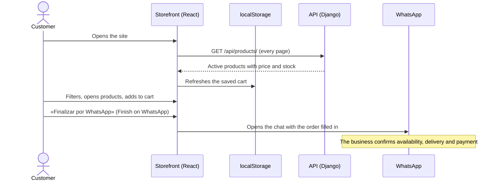
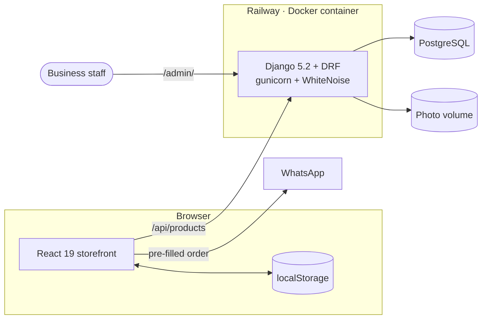

<div align="center">

# Delicaté

**Online store and brand site for handmade soaps from the Dominican Republic.**
Django-managed catalog, account-free cart and orders that close on WhatsApp.

[](https://github.com/JonasJavier/Delicate-4.0/actions/workflows/ci.yml)
[](https://delicate.jonasjavier.dev)


**[delicate.jonasjavier.dev](https://delicate.jonasjavier.dev)**


</div>

> The storefront is in Spanish because its customers are in the Dominican Republic. Interface labels quoted in this README (such as «Agregar», "Add") are shown in Spanish with their meaning in English.

## Contents

- [Why it exists](#why-it-exists)
- [Screenshots](#screenshots)
- [Features](#features)
- [How an order works](#how-an-order-works)
- [Architecture](#architecture)
- [Tech stack](#tech-stack)
- [Local development](#local-development)
- [Quality and tests](#quality-and-tests)
- [Deployment](#deployment)
- [API](#api)
- [Design decisions](#design-decisions)
- [Project history](#project-history)
- [Credits and license](#credits-and-license)

## Why it exists

Delicaté sells through conversation: customers ask, choose and arrange delivery on WhatsApp. A store with accounts, checkout and online payments would promise an operation the business does not run. This site does what is actually needed:

- **presents the brand** and the catalog with its own identity;
- **helps customers choose**, with the ingredients, benefits and skin type of every soap;
- **delivers a clear order** to WhatsApp, with products, quantities and an estimated total;
- **lets the business maintain the catalog** without touching code or redeploying the frontend.

## Screenshots

| Catalog with filters | Product details |
| --- | --- |
|  |  |
| **Cart ready for WhatsApp** | **Cart refreshed on return** |
|  |  |
| **Catalog administration** | **Catalog error with retry** |
|  |  |

<details>
<summary><strong>Mobile</strong> (390 px)</summary>

| Home | Catalog | Product | Cart |
| --- | --- | --- | --- |
|  |  |  |  |

</details>

The screenshots use the ten demo products created by the `seed_products` command.

## Features

**Storefront**

- Catalog loaded from the API on every visit (all pages), with filters for six categories.
- Product details in a native `<dialog>`: price, stock, benefit, skin type, ingredients and weight.
- Sold-out products stay visible but cannot be added to the cart.
- Loading, error-with-retry and empty-category states; production never falls back to an invented catalog.
- Side cart without sign-up, stored in `localStorage`, with quantities capped at available stock.
- **Self-updating cart:** on return it refreshes prices, adjusts quantities, drops products that no longer exist and tells the customer.
- Cart and contact form turned into a pre-filled WhatsApp message.
- Responsive layout; on touch screens the «Agregar» (Add) button is always visible.
- Accessibility: skip-to-content link, focus trapped in the cart, Escape to close, `aria-pressed` on filters and `prefers-reduced-motion` support.
- Link previews for WhatsApp and social networks (Open Graph 1200×630), icons for iOS and Android.

**Administration (Django Admin)**

- Price, stock, featured flag and visibility editable directly in the product list.
- Filters by category, featured flag and status; search by name, description and ingredients.
- Validated photo uploads (JPG, PNG or WebP, 5 MB max), stored on a persistent volume.
- Email-based sign-in for staff only: shoppers never create an account.

**Production**

- A single container serves the storefront, API, admin and photos from the same domain.
- Migrations run before release, and traffic switches only if the health check (which queries the database) passes.
- Security headers (CSP, HSTS, Permissions-Policy, X-Frame-Options), secure cookies and rate limiting.

## How an order works



Message generated by the cart (sent in Spanish, as customers see it):

```text
¡Hola, Delicaté!
Quiero realizar este pedido:

• 2 × Avena Calma — RD$700
• 1 × Corazón de Lavanda — RD$425

Total estimado: RD$1,125

Mi nombre es:
Prefiero: entrega / recoger

¿Me confirman disponibilidad y forma de entrega? Gracias.
```

It greets the business, lists each product with quantity and subtotal, gives the estimated total and leaves blanks for the customer's name and delivery or pickup preference.

## Architecture



| Path | Served by |
| --- | --- |
| `/`, `/assets/*`, icons | React build served by WhiteNoise (gzip, immutable caching for hashed files) |
| `/api/*` | Django REST Framework |
| `/admin/` | Django Admin |
| `/media/*` | Photos uploaded from the admin, on a persistent volume |

In development, Vite (`:5173`) proxies `/api` and `/media` to Django (`:8000`).

## Tech stack

| Layer | Technology |
| --- | --- |
| Frontend | React 19 · Vite 8 · hand-written CSS (no UI framework) · 2 runtime dependencies |
| Backend | Python 3.13 · Django 5.2 LTS · Django REST Framework 3.17 |
| Data | PostgreSQL in production · SQLite in development |
| Server | Gunicorn · WhiteNoise |
| Infrastructure | Docker (multi-stage build) · Railway · custom domain over HTTPS |
| Quality | Django/DRF tests · ESLint · GitHub Actions |

## Local development

Requirements: Python 3.12+ and Node.js 22.12+.

```bash
# Backend (from the repository root)
python -m venv .venv
source .venv/bin/activate          # Windows: .\.venv\Scripts\Activate.ps1
pip install -r backend/requirements.txt
python backend/manage.py migrate
python backend/manage.py seed_products
python backend/manage.py createsuperuser
python backend/manage.py runserver
```

```bash
# Frontend (second terminal)
cd frontend
npm ci
npm run dev
```

- Storefront: <http://127.0.0.1:5173> · API: <http://127.0.0.1:8000/api/products/> · Admin: <http://127.0.0.1:8000/admin/>
- The defaults work for development. To customise them, copy [`.env.example`](.env.example) to `.env` at the repository root.
- `seed_products` creates ten demo products and copies their photos. Do not run it against a catalog you have already edited: it resets those products.

To try the production image locally:

```bash
docker build -t delicate .
docker run --rm -p 8080:8000 -e DJANGO_SECRET_KEY=local-only-replace-with-a-long-random-key \
  -e DJANGO_ALLOWED_HOSTS=localhost -e DJANGO_SECURE_SSL_REDIRECT=False delicate
```

## Quality and tests

```bash
python backend/manage.py test                         # 18 tests
python backend/manage.py check
python backend/manage.py makemigrations --check --dry-run
cd frontend && npm run lint && npm run build
```

The tests cover the catalog API (filters, detail, hidden products, pagination), the demo data command, the public forms and their rate limits, the health check, photo serving (including an attempt to escape the media folder) and the security headers. [GitHub Actions](.github/workflows/ci.yml) runs everything on every push.

## Deployment

Production runs on Railway: the web service is built from the [`Dockerfile`](Dockerfile), uses PostgreSQL and a volume for photos, and is served at [delicate.jonasjavier.dev](https://delicate.jonasjavier.dev). Every push to `main`:

1. builds the React app and the Django image;
2. runs `migrate` before the release;
3. switches traffic only when `/api/health/` returns 200.

Variables, day-to-day operations and the domain setup: [docs/DEPLOY_RAILWAY.md](docs/DEPLOY_RAILWAY.md). Business launch checklist: [docs/GO_LIVE.md](docs/GO_LIVE.md).

<details>
<summary><strong>Environment variables</strong></summary>

| Variable | Purpose |
| --- | --- |
| `DJANGO_SECRET_KEY` | Long private key (required when `DEBUG` is off) |
| `DJANGO_DEBUG` | `True` locally; the Docker image defaults to `False` |
| `DJANGO_ALLOWED_HOSTS` / `CSRF_TRUSTED_ORIGINS` | Custom domains (the Railway domain is added automatically) |
| `DATABASE_URL` | PostgreSQL; SQLite is used when it is missing |
| `DJANGO_MEDIA_ROOT` | Absolute folder for photos; on Railway it is derived from the volume |
| `DJANGO_TRUST_PROXY_SSL_HEADER` / `DJANGO_NUM_PROXIES` | HTTPS proxy and real visitor IP (automatic on Railway) |
| `VITE_WHATSAPP_NUMBER` / `VITE_WHATSAPP_DISPLAY` | Business number (embedded at build time) |
| `VITE_SITE_URL` | Public URL for link previews and the canonical tag |
| `VITE_ENABLE_DEMO_CATALOG` | `true` only for demos; `false` in production |

</details>

## API

| Method | Path | Description |
| --- | --- | --- |
| `GET` | `/api/health/` | Service and database status (503 if the database does not respond) |
| `GET` | `/api/products/` | Active products, paginated · `?category=` · `?featured=true` · `?search=` · `?page_size=` (≤ 100) |
| `GET` | `/api/products/<slug>/` | Single product |
| `POST` | `/api/contact/` | Contact message (10 per hour per visitor) |
| `POST` | `/api/newsletter/` | Email subscription (5 per hour per visitor) |

The catalog is read-only through the API; it is edited in Django Admin.

## Design decisions

| Problem | Decision |
| --- | --- |
| The price of a handmade soap is justified by the brand, not by a product list. | The home page introduces the brand before the store, with a single primary action. |
| Requiring sign-up to buy a soap adds friction without adding value. | There are no customer accounts; the cart lives in the browser. |
| A checkout that cannot take payment is a broken promise. | The cart builds the order, states that the site does not charge and closes it on WhatsApp. |
| A cart saved days ago can send outdated prices. | On return, the cart is refreshed from the live catalog and the customer is told what changed. |
| Touch screens have no hover to reveal the buy button. | «Agregar» (Add) is always visible and the filters scroll in a single row. |
| Showing invented products when the API fails misleads the customer. | Production shows an error with a retry; the demo catalog exists only in development. |

## Project history

- **2024 — first store.** A conventional e-commerce site with sign-up, Google sign-in, a server-side cart, reviews, order history and a blog.
- **August 2026 — rebuild (4.0).** Customer accounts, the server-side cart, reviews and profiles were removed (through explicit migrations), and the flow now closes on WhatsApp.
- **September 2026 — production.** Django hardening, a cart that syncs with the catalog, Docker/Railway deployment and a custom domain.

The next product line, a guided custom-soap configurator, is specified in [docs/ATELIER_CUSTOM_SOAP.md](docs/ATELIER_CUSTOM_SOAP.md) and is not part of the system yet.

## Credits and license

Design and development: **Jonas Javier Encarnacion**.
The lifestyle photos on the home page and in the story section were generated for this version; the product photos come from the original project.

© 2024-2026 Jonas Javier Encarnacion. All rights reserved over the code, design, brand, catalog and visual materials: this repository may be viewed for evaluation, but it may not be reused without written permission. See [LICENSE](LICENSE).
