<div align="center">

# Delicaté

**Tienda en línea y sitio de marca para jabones artesanales hechos en República Dominicana.**
Catálogo administrable en Django, carrito sin registro y pedidos que se cierran por WhatsApp.

[](https://github.com/JonasJavier/Delicate-4.0/actions/workflows/ci.yml)
[](https://delicate.jonasjavier.dev)


**[delicate.jonasjavier.dev](https://delicate.jonasjavier.dev)**

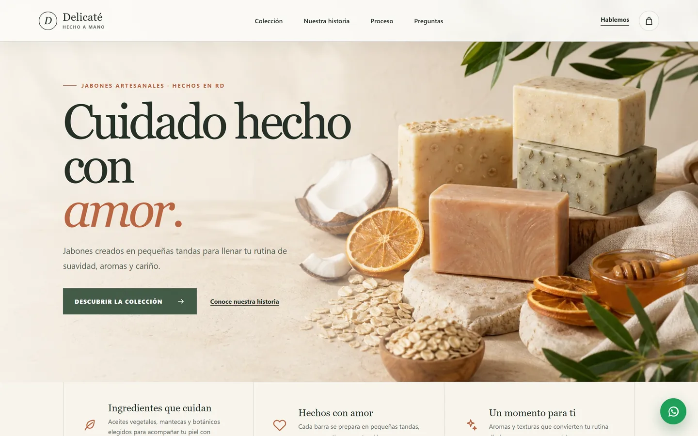

</div>

> **English summary.** Delicaté is a production e-commerce site for a Dominican artisan soap brand, built for a client. Customers browse a Django-managed catalog, fill a cart without creating an account and send a pre-filled order through WhatsApp, the channel where the business already confirms, charges and delivers. React 19 + Vite on the front, Django 5.2 + Django REST Framework on the back, deployed as a single Docker service on Railway with PostgreSQL.

## Índice

- [Por qué existe](#por-qué-existe)
- [Capturas](#capturas)
- [Funcionalidades](#funcionalidades)
- [Cómo funciona un pedido](#cómo-funciona-un-pedido)
- [Arquitectura](#arquitectura)
- [Stack](#stack)
- [Desarrollo local](#desarrollo-local)
- [Calidad y pruebas](#calidad-y-pruebas)
- [Despliegue](#despliegue)
- [API](#api)
- [Decisiones de diseño](#decisiones-de-diseño)
- [Historia del proyecto](#historia-del-proyecto)
- [Créditos y licencia](#créditos-y-licencia)

## Por qué existe

Delicaté vende por conversación: el cliente pregunta, elige y coordina la entrega por WhatsApp. Una tienda con cuentas, checkout y pagos prometería una operación que el negocio no tiene. Este sitio hace lo que sí hace falta:

- **presentar la marca** y el catálogo con una identidad propia;
- **ayudar a elegir**, con ingredientes, beneficios y tipo de piel de cada jabón;
- **entregar un pedido claro** en WhatsApp, con productos, cantidades y total estimado;
- **dejar que el negocio mantenga el catálogo** sin tocar código ni volver a publicar el frontend.

## Capturas

| Catálogo con filtros | Ficha de producto |
| --- | --- |
| 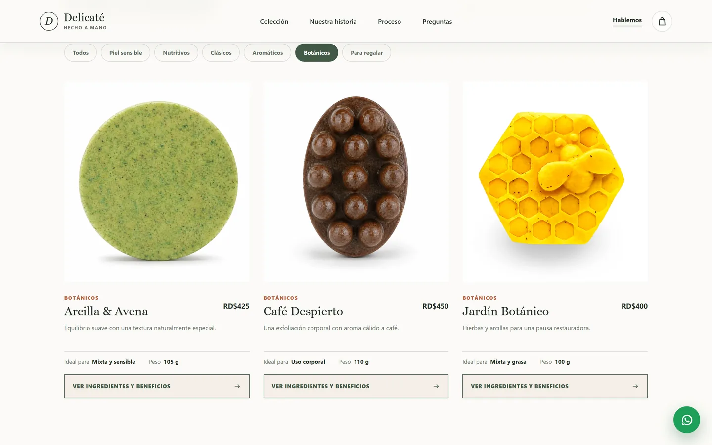 | 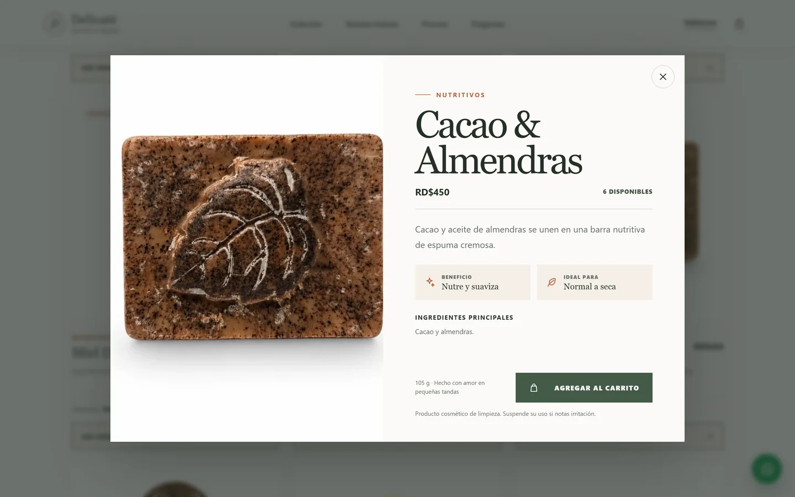 |
| **Carrito listo para WhatsApp** | **Carrito actualizado al volver** |
| 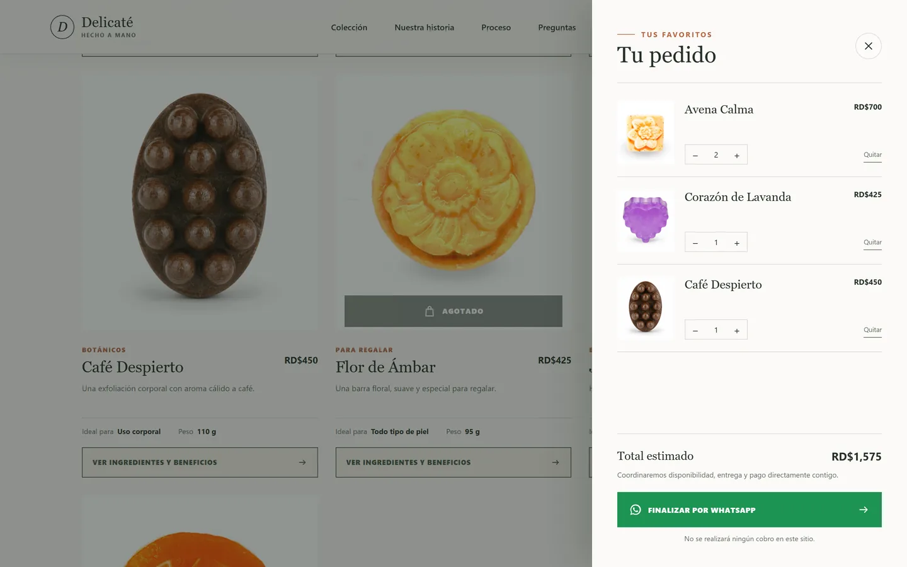 | 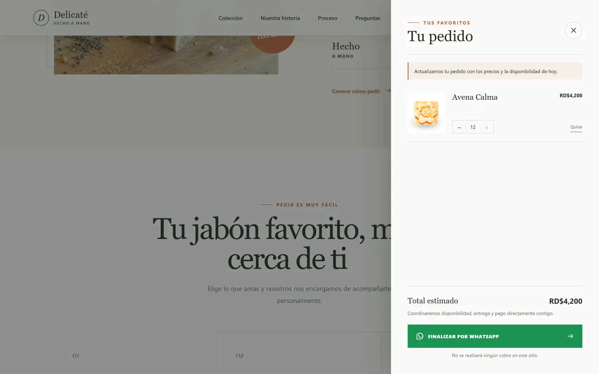 |
| **Administración del catálogo** | **Error de catálogo con reintento** |
| 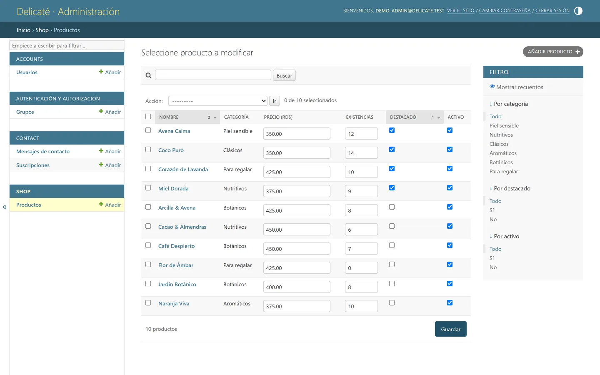 | 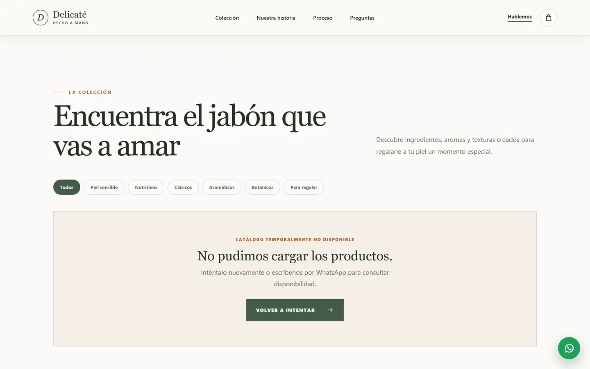 |

<details>
<summary><strong>Versión móvil</strong> (390 px)</summary>

| Portada | Catálogo | Ficha | Carrito |
| --- | --- | --- | --- |
| 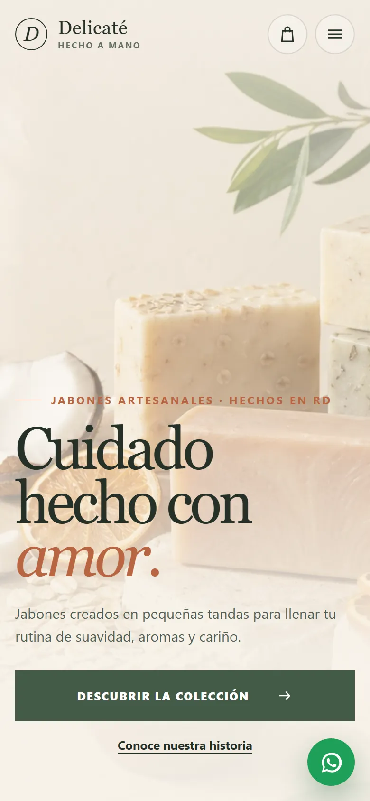 | 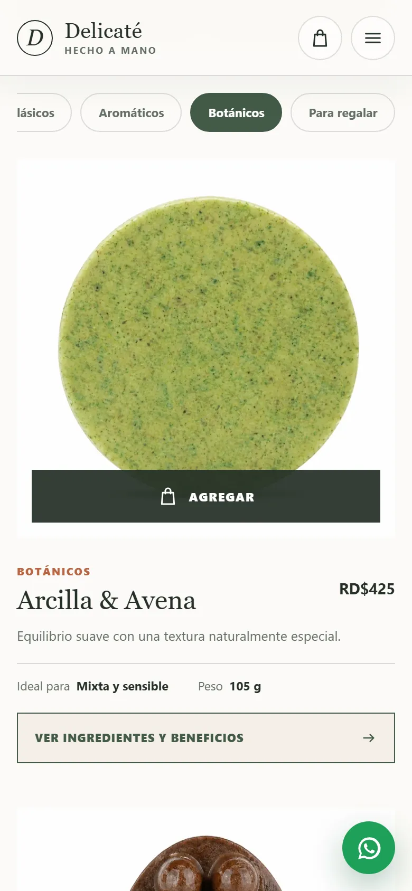 | 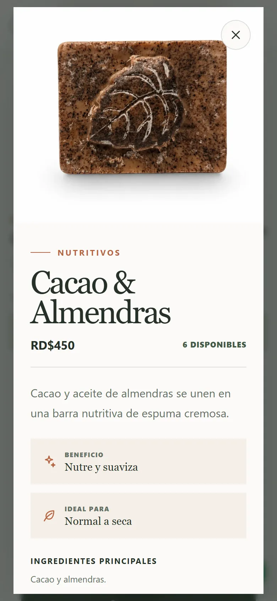 | 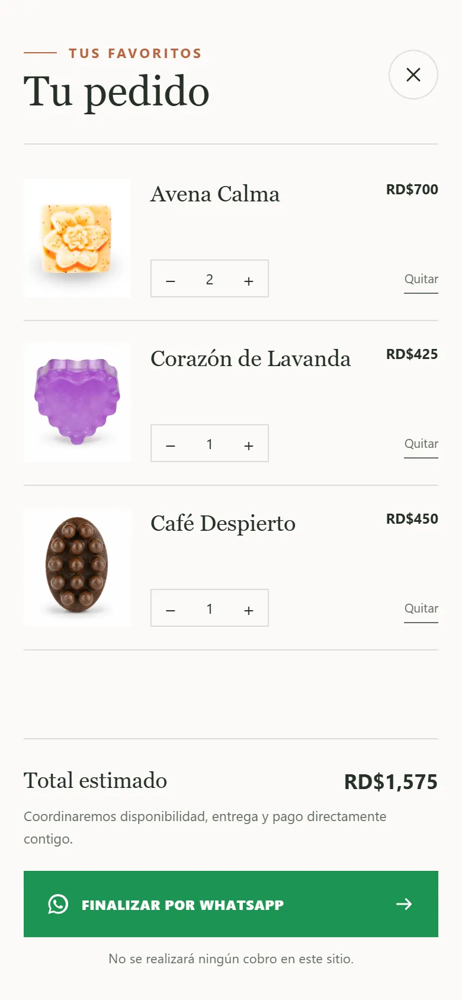 |

</details>

Las capturas usan los diez productos de demostración del comando `seed_products`.

## Funcionalidades

**Tienda**

- Catálogo leído desde la API en cada visita (todas las páginas), con filtros por seis categorías.
- Ficha de producto en un `<dialog>` nativo: precio, existencias, beneficio, tipo de piel, ingredientes y peso.
- Productos agotados visibles pero no comprables.
- Estados de carga, error con reintento y categoría vacía; en producción nunca se muestra un catálogo inventado.
- Carrito lateral sin registro, guardado en `localStorage`, con cantidades limitadas a las existencias.
- **Carrito sincronizado:** al volver, actualiza precios, ajusta cantidades, retira productos que ya no existen y lo avisa.
- Pedido y formulario de contacto convertidos en un mensaje prearmado de WhatsApp.
- Diseño responsive; en pantallas táctiles el botón «Agregar» siempre está visible.
- Accesibilidad: enlace para saltar al contenido, foco atrapado en el carrito, Escape para cerrar, `aria-pressed` en filtros y `prefers-reduced-motion`.
- Vista previa para WhatsApp y redes (Open Graph 1200×630), íconos para iOS y Android.

**Administración (Django Admin)**

- Precio, existencias, destacado y visibilidad editables en la propia lista de productos.
- Filtros por categoría, destacado y estado; búsqueda por nombre, descripción e ingredientes.
- Subida de fotos validada (JPG, PNG o WebP, máximo 5 MB), guardadas en un volumen persistente.
- Acceso por correo sólo para el equipo: los compradores nunca crean cuenta.

**Producción**

- Un solo contenedor sirve tienda, API, admin y fotos desde el mismo dominio.
- Migraciones antes de publicar y publicación sólo si el healthcheck (que consulta la base de datos) responde.
- Cabeceras de seguridad (CSP, HSTS, Permissions-Policy, X-Frame-Options), cookies seguras y límites de frecuencia.

## Cómo funciona un pedido

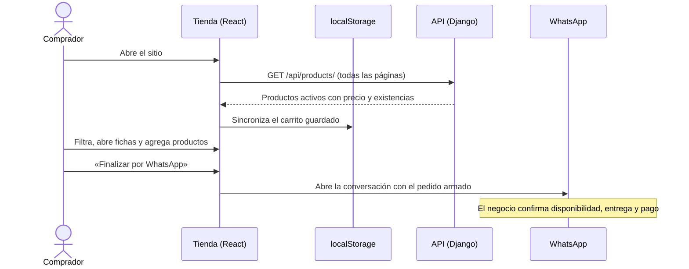

Mensaje que genera el carrito:

```text
¡Hola, Delicaté!
Quiero realizar este pedido:

• 2 × Avena Calma — RD$700
• 1 × Corazón de Lavanda — RD$425

Total estimado: RD$1,125

Mi nombre es:
Prefiero: entrega / recoger

¿Me confirman disponibilidad y forma de entrega? Gracias.
```

## Arquitectura

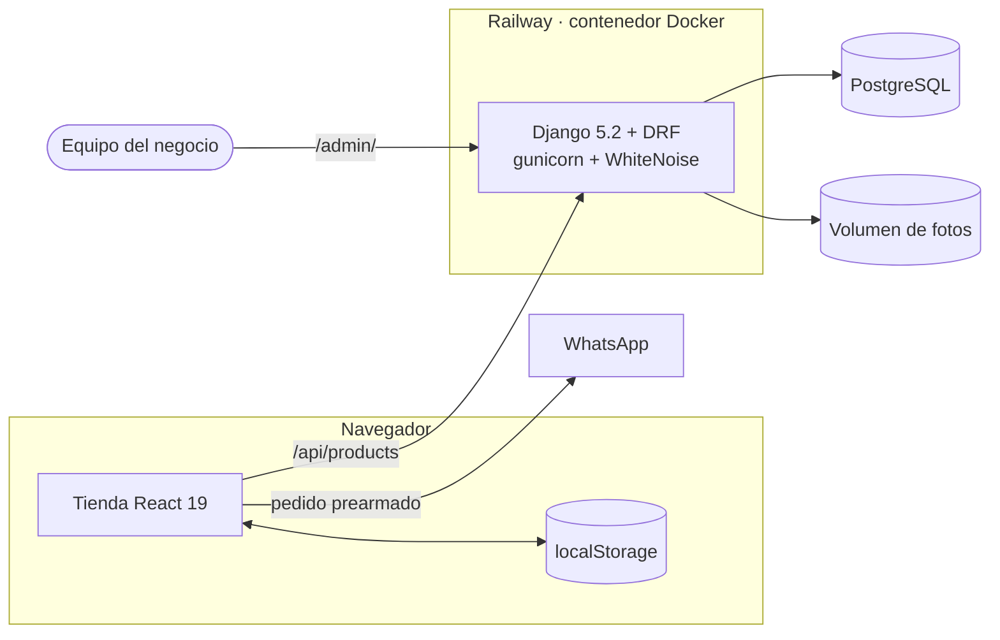

| Ruta | La atiende |
| --- | --- |
| `/`, `/assets/*`, íconos | Build de React servido por WhiteNoise (gzip, caché inmutable en archivos con hash) |
| `/api/*` | Django REST Framework |
| `/admin/` | Django Admin |
| `/media/*` | Fotos subidas desde el admin, en un volumen persistente |

En desarrollo, Vite (`:5173`) hace de proxy de `/api` y `/media` hacia Django (`:8000`).

## Stack

| Capa | Tecnología |
| --- | --- |
| Frontend | React 19 · Vite 8 · CSS propio (sin framework de UI) · 2 dependencias de ejecución |
| Backend | Python 3.13 · Django 5.2 LTS · Django REST Framework 3.17 |
| Datos | PostgreSQL en producción · SQLite en desarrollo |
| Servidor | Gunicorn · WhiteNoise |
| Infraestructura | Docker (build multietapa) · Railway · dominio propio con HTTPS |
| Calidad | Pruebas de Django/DRF · ESLint · GitHub Actions |

## Desarrollo local

Requisitos: Python 3.12+ y Node.js 22.12+.

```bash
# Backend (desde la raíz del repositorio)
python -m venv .venv
source .venv/bin/activate          # Windows: .\.venv\Scripts\Activate.ps1
pip install -r backend/requirements.txt
python backend/manage.py migrate
python backend/manage.py seed_products
python backend/manage.py createsuperuser
python backend/manage.py runserver
```

```bash
# Frontend (otra terminal)
cd frontend
npm ci
npm run dev
```

- Tienda: <http://127.0.0.1:5173> · API: <http://127.0.0.1:8000/api/products/> · Admin: <http://127.0.0.1:8000/admin/>
- Los valores por defecto sirven para desarrollo. Para personalizarlos, copia [`.env.example`](.env.example) a `.env` en la raíz.
- `seed_products` crea diez productos de demostración y copia sus fotos. No lo ejecutes sobre un catálogo ya editado: restablece esos productos.

Para probar la imagen de producción en local:

```bash
docker build -t delicate .
docker run --rm -p 8080:8000 -e DJANGO_SECRET_KEY=solo-local-cambia-esta-clave-por-una-larga \
  -e DJANGO_ALLOWED_HOSTS=localhost -e DJANGO_SECURE_SSL_REDIRECT=False delicate
```

## Calidad y pruebas

```bash
python backend/manage.py test                         # 18 pruebas
python backend/manage.py check
python backend/manage.py makemigrations --check --dry-run
cd frontend && npm run lint && npm run build
```

Las pruebas cubren la API del catálogo (filtros, detalle, productos ocultos, paginación), el comando de datos demo, los formularios públicos y sus límites de frecuencia, el healthcheck, el servicio de fotos (incluido un intento de salir de la carpeta) y las cabeceras de seguridad. [GitHub Actions](.github/workflows/ci.yml) ejecuta todo en cada push.

## Despliegue

Producción corre en Railway: el servicio web se construye con el [`Dockerfile`](Dockerfile), usa PostgreSQL y un volumen para las fotos, y se publica en [delicate.jonasjavier.dev](https://delicate.jonasjavier.dev). Cada push a `main`:

1. construye React y la imagen de Django;
2. ejecuta `migrate` antes de publicar;
3. cambia el tráfico sólo si `/api/health/` responde 200.

Variables, operación diaria y dominio: [docs/DEPLOY_RAILWAY.md](docs/DEPLOY_RAILWAY.md). Lista de salida comercial: [docs/GO_LIVE.md](docs/GO_LIVE.md).

<details>
<summary><strong>Variables de entorno</strong></summary>

| Variable | Uso |
| --- | --- |
| `DJANGO_SECRET_KEY` | Clave larga y privada (obligatoria con `DEBUG` apagado) |
| `DJANGO_DEBUG` | `True` en local; la imagen Docker usa `False` |
| `DJANGO_ALLOWED_HOSTS` / `CSRF_TRUSTED_ORIGINS` | Dominios propios (el de Railway se añade solo) |
| `DATABASE_URL` | PostgreSQL; sin ella se usa SQLite |
| `DJANGO_MEDIA_ROOT` | Carpeta absoluta de fotos; en Railway se deriva del volumen |
| `DJANGO_TRUST_PROXY_SSL_HEADER` / `DJANGO_NUM_PROXIES` | Proxy HTTPS e IP real del visitante (automáticos en Railway) |
| `VITE_WHATSAPP_NUMBER` / `VITE_WHATSAPP_DISPLAY` | Número del negocio (se incrusta al construir) |
| `VITE_SITE_URL` | URL pública para vistas previas y etiqueta canónica |
| `VITE_ENABLE_DEMO_CATALOG` | `true` sólo en demos; en producción, `false` |

</details>

## API

| Método | Ruta | Descripción |
| --- | --- | --- |
| `GET` | `/api/health/` | Estado del servicio y de la base de datos (503 si no responde) |
| `GET` | `/api/products/` | Productos activos paginados · `?category=` · `?featured=true` · `?search=` · `?page_size=` (≤ 100) |
| `GET` | `/api/products/<slug>/` | Detalle de un producto |
| `POST` | `/api/contact/` | Mensaje de contacto (10 por hora por visitante) |
| `POST` | `/api/newsletter/` | Suscripción por correo (5 por hora por visitante) |

El catálogo es de sólo lectura por la API; se edita desde Django Admin.

## Decisiones de diseño

| Problema | Decisión |
| --- | --- |
| El precio de un jabón artesanal se sostiene con la marca, no con un listado. | La portada presenta la marca antes que la tienda, con una sola acción principal. |
| Pedir registro para comprar un jabón añade fricción sin aportar valor. | No hay cuentas de cliente; el carrito vive en el navegador. |
| Un checkout que no puede cobrar es una promesa rota. | El carrito arma el pedido, aclara que no cobra y lo cierra en WhatsApp. |
| Un carrito guardado días antes puede enviar precios viejos. | Al volver, el carrito se actualiza con el catálogo real y avisa del cambio. |
| En pantallas táctiles no hay hover que descubra el botón de compra. | «Agregar» queda siempre visible y los filtros se desplazan en una fila. |
| Si la API falla, mostrar productos inventados engaña al comprador. | Producción muestra un error con reintento; el catálogo demo sólo existe en desarrollo. |

## Historia del proyecto

- **2024 — primera tienda.** E-commerce convencional con registro, inicio de sesión con Google, carrito en servidor, reseñas, historial de pedidos y blog.
- **Agosto de 2026 — reconstrucción (4.0).** Se retiraron cuentas de cliente, carrito en servidor, reseñas y perfiles (con migraciones explícitas) y el flujo pasó a cerrarse por WhatsApp.
- **Septiembre de 2026 — producción.** Endurecimiento de Django, carrito sincronizado con el catálogo, despliegue en Docker/Railway y dominio propio.

La siguiente línea, un configurador guiado de jabón personalizado, está especificada en [docs/ATELIER_JABON_PERSONALIZADO.md](docs/ATELIER_JABON_PERSONALIZADO.md) y todavía no forma parte del sistema.

## Créditos y licencia

Diseño y desarrollo: **Jonas Javier Encarnacion**, para Delicaté.
La marca Delicaté, su catálogo y sus fotografías pertenecen a su propietaria. Las fotografías de ambiente de la portada y de la historia se generaron para esta versión; las de producto proceden del proyecto original.

Código propietario, todos los derechos reservados: puede consultarse para evaluación, pero no reutilizarse sin permiso escrito. Ver [LICENSE](LICENSE).
